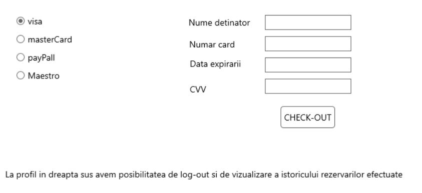

# around-the-world
### Introducere 
------

- Care este principala nevoie/problemă pe care o rezolvă proiectul nostru?

Aplicaţia “Around the World” a fost gândită pentru cei care se întreabă “De unde începe lumea şi unde se termină ea?“, pentru călătorii de pretutindeni care doresc să se elibereze de automatismele cotidiene şi şă descopere noi realităţi. Astfel, aceasta îşi propune să facă parte din ritualul escapadelor, ajutând la găsirea celor mai bune oferte pentru destinaţiile dorite.

“Around the World” pune la dispoziţie toate informţiile de care este nevoie pentru planificarea vacanţei: bilete, cazare, iar pentru fiecare destinaţie aleasă există un top al principalelor atracţii turistice, care simplifică procesul de luare a unei decizii în ceea ce priveşte următoarea vacanţă. Aşadar, cu un cont în care vor fi salvate toate rezervările, această aplicaţie poate deveni rapid “paşaportul oricărui călător”.

- Cărui tip de utilizatori se adresează produsul nostru? 

Produsul nostru este în esență o aplicație web care pune la dispoziție o alegere variată a unor posibile călătorii memorabile și se adresează în primul rând persoanelor fizice, care printre pasiunile lor se regăsesc călătoria și descoperirea locurilor noi și pline de istorie. Totodată, se adresează persoanelor care printr-un simplu click vor să-și planifice vacanța, având la dispoziție toate informațiile necesare despre locul în care vor călători.

- Ce alte produse similare există pe piață?

Pe piață există numeroase aplicații similare cu around-the-world. Am realizat un scurt research în urma căruia am descoperit câteva tipuri de aplicații, toate având la bază satisfacerea dorinței clientului de a călători:
- Aplicații specializate pe găsirea și rezervarea locurilor la cazare: hotelscan.com, trivago.ro, hotels.com
- Aplicații care oferă mai mult decât camere la hotel. Ajută clienții să găsească atât bilete de avion la prețuri cât mai avantajoase, cât și închirieri de mașini sau asigurări de călătorie. Ex: booking.com, esky.ro, vola.ro, tripadvisor.com, momondo.ro
De asemenea, există și site-uri web care promovează pachete de vacanță deja organizate de către agenții de turism: tui-travelcenter.ro, citiesbreak.com

Toate aceste site-uri se concentrează pe vânzarea cât mai multor pachete de vacanță, pe rezervarea cât mai multor camere de hotel sau zboruri de avion, adoptând un stil specific promovării unor servicii, stilul comercial. Aplicația noastră, însă, se axează pe găsirea locației perfecte deoarece considerăm că acesta este cel mai important aspect în organizarea unei călătorii. Este important pentru clienți să găsească locul potrivit pentru ei, un loc în care se pot dezvolta din punct de vedere cultural, un loc în care se pot relaxa, un loc în care pot gusta din cultura specifică zonei vizitate, dacă acesta este lucrul pe care și-l doresc. Ne propunem să realizăm acest lucru prin oferirea unor descrieri ale locațiilor alese, prezentarea obiectivelor turistice care se pot găsi în acel loc. 

### Interfețe aplicație 
------
”Around The World” este o aplicație web single-page, care va trece de la o etapă la alta a organizării unei călătorii în mod dinamic. 

 

În momentul accesării aplicaţiei, utilizatorului i se deschide o pagină de validare a datelor personale, ceea ce presupune autentificarea cu un cont deja existent sau posibilitatea de creare a unui cont nou. Astfel, fiecărei opţiuni dintre acestea două îi corespunde un buton, care va redirecţiona utilizatorul către pagini diferite, în funcţie de ceea ce a selectat.


Realizarea unui cont nou presupune introducerea datelor personale în câmpurile speciale : nume, prenume, parolă, telefon, pentru eventualele informaţii suplimentare, adresa de e-mail,  astfel încât utilizatorul să primească diferite oferte sau confirmarea rezervărilor, dar şi vârsta pentru a restricţiona accesul minorilor.
Autentificarea presupune introducerea adresei de e-mail şi a parolei pentru a avea acces mai departe la următoarele facilităţi ale aplicaţiei.


După ce utilizatorul își creează un cont sau se loghează la contul lui deja existent, el poate începe o frumoasă expediție a găsirii locului perfect pentru călătoria sa. În partea de sus utilizatorul își va putea alege destinația preferată și selectând un anumit oraș, îi va apărea în partea de jos cele mai importante și interesante obiective turistice din locul respectiv, pe care el le poate vizita. În urma hotărârii locului perfect, va putea da click în partea din dreapta jos pe butonul intitulat “Aici vreau sa merg!”.
După ce utilizatorul se decide care este locația perfectă pentru vacanța pe care și-o dorește, urmează să aleagă un loc de cazare și un bilet de avion,  dacă este necesar. 


În partea de sus, utilizatorul va selecta data plecării și data returului și numărul de persoane care vor participa. În colțul din dreapta vom prezenta temperaturile care vor fi în orașul ales în perioada selectată. Pentru a face acest lucru vom realiza integrarea OpenWeatherMap. În partea de jos vom avea două tab-uri care îi vor permite utilizatorului să aleagă un loc de cazare și un zbor dacă este necesar. Am luat în calcul posibilitatea ca un utilizator să își dorească să ajungă la locația aleasă cu propriul mijloc de transport, iar în cazul acesta nu va fi nevoie de cumpărarea unui bilet de avion. Va fi activ un singur tab la un moment dat. În mod implicit, va fi activ tab-ul CAZARE. Aici va fi o listă de hoteluri. Utilizatorul va putea da click pentru a vedea mai multe detalii precum facilități și tarife pentru un anumit hotel, iar pentru a face rezervare, se va folosi de un checkbox care se va găsi în partea dreaptă, în dreptul hotelului.


În cazul în care clientul își dorește să cumpere și bilete de avion, va da click pe tab-ul ZBORURI unde va selecta moneda în care vor fi afișate prețurile acestora și orașul din care va pleca. Mai jos va fi afișat un tabel cu zboruri dus-întors ce va include diverse informații despre ele, precum ore și tarife. Pentru a alege zborul, utilizatorul se va folosi de același checkbox care se poate găsi și în tab-ul pentru cazare. De asemenea, în partea de jos va fi afișat totalul de plată.
Pentru a finaliza rezervarea, va da click pe butonul din dreapta, jos, care îl va duce la pagina pentru plată. 



În urma deciderii utilizatorului asupra zborului sau/și cazării, el va putea achita plata alegând tipul cardului pe care îl deține și completând în partea dreaptă a paginii câmpurile cu datele personale inscripționate pe card. După ce datele au fost introduse corect, utilizatorul poate finaliza plata dând click pe butonul de sub câmpurile cu datele personale, pe care scrie “CHECK-OUT”. După ce utilizatorul și-a planificat vacanța, poate ieși din cont accesând iconița intitulată “Profil” din dreapta sus a paginii și selectând opțiunea log-out.

### REST API - exemple de request și răspuns
------
1. **POST /user** - înregistrare utilizator
2. **GET /locations** - afișarea destinațiilor pe care utilizatorul le poate alege
- răspuns:
```javascript
locations:
  [
  location1:{ “denumire”: “Londra”}, 
  location2:{“denumire”: “Paris”}, 
  location3:{“denumire”: “Viena”}
  ]
```
3. **GET /location/info** - descrierea obiectivelor turistice în funcție de locația aleasă 
- răspuns: 
```javascript
objectives:
[
    obiectiv1:
    { 
      “denumire”: “London Eye”,
      “descriere”: “o descriere”
    }, 
    obiectiv2:
    {
    “denumire”: “Big Ben”,
    “descriere”:”o descriere”
    }, 
    obiectiv3:
    {
    “denumire”: “Madame Tussaud”,
    “descriere:” “o descriere ”
    }
]
```
4. **GET /location/hotels** - descrierea hotelurilor dintre care utilizatorul poate alege
- răspuns:
```javascript
[
    hotel1:
    { 
        “denumire”: “X”,
        “descriere”: “o descriere”,
        “tarife”: “tarif”,
        “facilitati”:”niste facilitati”,
        “nr stele”: 5,
        “adresa”:”o adresa”
       }, 
    hotel2:
    {
        “denumire”: “Y”,
        “descriere”: “o descriere”,
        “tarife”: “tarif”,
        “facilitati”:”niste facilitati”,
        “nr stele”: 5,
        “adresa”:”o adresa”
        }, 
    hotel3:
    {
        “denumire”: “Z”,
        “descriere”: “o descriere”,
        “tarife”: “tarif”,
        “facilitati”:”niste facilitati”,
        “nr stele”: 5,
        “adresa”:”o adresa”

         }
]
```
5. **GET /cities** - orașele dintre care utilizatorul poate alege pentru plecare 
- răspuns: 
```javascript
[
    city1:
    { 
      “denumire”: “Bucuresti”
    }, 
    city2:
    {
      “denumire”: “Cluj”
    }, 
    city3:
    {
      “denumire”: “Baia Mare”
    }
]
```
6. **GET /location/flights** - lista de zboruri disponibile
- răspuns: 
```javascript
 [
    flight1:
    { 
        “numar zbor”: “X”,
        “pret”: 50,
        “categorie”:”Economy”,
        “destinatie”:”Londra- aeroportul pe care se aterizeaza”,
        “compania aeriana”:”Wizz Air”,
        “locuri”:
          [
            loc1: {“numar”: “34”},
            loc2:{”numar”:”45”}
          ]
       }, 
    flight2:
    {
      “numar zbor”: “Y”,
      “pret”: 50,
      “categorie”:”Economy”,
      “destinatie”:”Londra- aeroportul pe care se aterizeaza”,
      “compania aeriana”:”Wizz Air”,
      “locuri”:
          [
              loc1: {“numar”: “37”},
              loc2:{”numar”:”49”}
          ]

        }, 
    flight3:
    {
        “numar zbor”: “Z”,
        “pret”: 50,
        “categorie”:”Economy”,
        “destinatie”:”Londra- aeroportul pe care se aterizeaza”,
        “compania aeriana”:”Wizz Air”,
        “locuri”:
          [
            loc1: {“numar”: “33”},
            loc2:{”numar”:”45”}
          ]
    }
]

```
7. **POST /location/hotel/reservation** - realizare rezervare la hotel
8. **POST /location/flight/reservation** - rezervare bilete de zbor
9. **POST /user/reservations** - înregistrarea rezervărilor în profilul utilizatorului
 10. **GET /user/reservations** - afișarea istoricului rezervărilor utilizatorului
- răspuns: 
```javascript
 [
    reservation1:
    { 
        “location”: “X”,
        “price”: 50,
        “date”:”01-01-2018”,
        “tip”:”REZERVARE HOTEL”,
        “companie”:”some hotel”
       }, 
    reservation2:
    {
      “location”: “Y”,
        “price”: 50,
        “date”:”02-02-2018”,
        “tip”:”BILET AVION”,
        “companie”:”Wizz Air”

        }, 
   reservation3:
    {
        “location”: “Z”,
        “price”: 50,
        “date”:”03-03-2018”,
        “tip”:”REZERVARE HOTEL”,
        “companie”:”some hotel”
    }
]

```
 11. **POST /check-out** - finalizare plată
